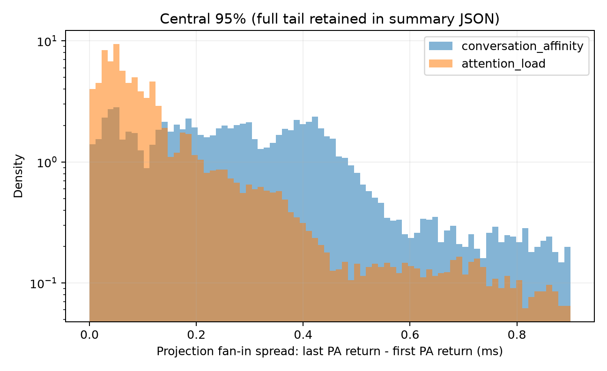
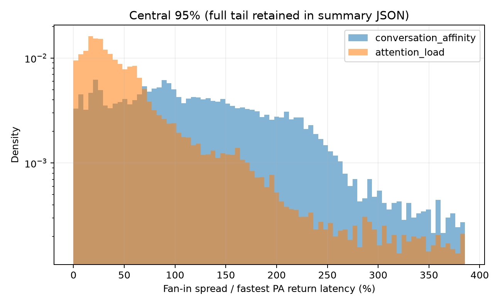

# PAP attention-load placement and KV migration pilot

> Controlled development evidence from one trace-off performance repetition
> and one trace-on diagnostic repetition per policy. The implementation is
> retained behind `PAP_ROUTING_POLICY=attention_load`; it is not the default.

Date: 2026-07-26

> Superseded placement boundary: this pilot selected and migrated before
> Prefill. The current policy runs later-turn Prefill on the history owner and
> selects the Decode PA after Prefill. See
> `PAP-20260727-POST-PREFILL-LATE-BINDING`.

## Transfer correction

The original C32 performance comparison below is retained as historical
evidence but is no longer a valid scheduler verdict. It ran with a fragmented
V2 KV layout and a NIXL/UCX path that delivered roughly 100-350 MB/s with tens
of thousands of descriptors per migration.

The same-node runtime is now pinned to NIXL 1.3.0, UCX 1.22.0, and
`UCX_PROTO_EMULATION_ENABLE=n`. The V1 cross-layer layout previously validated
on 2026-07-13 has also been ported to the V2 model runner required by PAP.

A 7PA1P, eight-session, five-turn canary completed 40/40 requests and all
runtime audits. Its 1.2-1.75 GiB migrations used 1-4 descriptors and reached
12.8-22.5 GB/s. The matching pre-fix canary used roughly 41K-56K descriptors
and reached 1.4-3.35 GB/s. A native 1P1D V2 control moved 2,254.5 MiB in
100.8 ms at 22.36 GB/s with one descriptor, matching the historical V1 result.

Raw correction artifacts remain machine-local under:

```text
benchmarks/pap/experiments/_staging/runs/
  20260726_native_pd_v2_crosslayer_fix/
benchmarks/pap/experiments/_staging/scheduling/20260726_nixl_ucx122_strict/runs/
  pap_c8_s8/
  pap_v2_crosslayer_c8_s8/
```

The corrected C32 attention-load versus conversation-affinity A/B is reported
below.

### Root cause in the vLLM model runner

This was an incomplete capability migration between the two model runners
inside the vLLM V1 engine, not a limitation of PCIe or NIXL:

- the older `vllm/v1/worker/gpu_model_runner.py` already allocated one
  cross-layer backing tensor, exposed strided per-layer views, and called
  `register_cross_layers_kv_cache()`;
- the newer `vllm/v1/worker/gpu/model_runner.py`, selected by
  `VLLM_USE_V2_MODEL_RUNNER=1`, still registered the ordinary per-layer cache
  dictionary. Its connector path explicitly carried a TODO for cross-layer
  support;
- `enable_cross_layers_blocks=True` therefore expressed connector preference
  but did not change V2 allocation or registration;
- Qwen3-8B then generated approximately `36 layers * 2004 blocks = 72144`
  descriptors for a 16K transfer.

PAP cannot use the older model runner as a workaround because asynchronous
sampled-token delivery is implemented only in V2. The fix mechanically ports
the proven uniform-layout path into V2: use it only for one uniform Attention
group whose backend indexes KV by block stride, otherwise retain the existing
general layout. The connector now registers the single cross-layer backing
tensor instead of the per-layer views.

The resulting 1-4 descriptors in PAP are contiguous block spans for the
request. They are no longer multiplied by the 36 model layers.

## Result

Fixing the transfer path reduced the first attention-load policy's throughput
penalty from 61.1% to 16.6%, confirming that slow migration caused most of the
original regression. The policy was then changed from unconstrained
minimum-load movement to sparse correction of total PA task load:

- each PA load is the sum of its active Prefill/Decode context and committed
  conversation context, not the largest request on that PA;
- a move must reduce cross-PA aggregate-load variance by at least 30%;
- migrations are separated by at least 64 later-turn admissions;
- only one migration may be unresolved at a time.

In two C32 repetitions, this reduced 512 possible later-turn moves to five and
eight successful migrations, with zero migration misses. Relative to a
same-session conversation-affinity control, the two-run mean improves TTFT by
6.4%, ITL by 11.0%, and request throughput by 4.1%. The general benchmark
default remains `conversation_affinity`; `attention_load` is an explicit
experimental policy with the validated sparse settings as its defaults.

## Treatment

The policy uses one load unit: context tokens.

- Admission reserves the new request's estimated full context on the PA with
  the lowest total committed load. This includes active Prefill/Decode context
  and the latest retained context of inactive conversations.
- Admission of a later turn removes that conversation's old reservation before
  evaluating the counterfactual stay and move load vectors.
- Completion removes active load, commits the new context length to the
  selected PA, and records the retained history owner.
- Equal-load placement prefers the history owner and avoids migration.
- A later turn migrates only when moving its complete task load reduces
  aggregate PA-load variance by the configured ratio and passes the interval
  and in-flight budgets. The source then exports the retained lease's NIXL
  metadata; the target pulls the exact historical prefix and computes only the
  new suffix.
- Completed-turn leases are pressure-evictable in LRU order. Active Decode
  leases are never pressure-evicted.

The baseline is `conversation_affinity`: conversations are assigned to PA
nodes round-robin and remain on their original PA for every later turn.

## Workload

- Qwen3-8B FP16, eager execution, 7PA1P on eight NVIDIA L20 GPUs.
- 128 conversations, five turns, 640 requests, concurrency 32.
- Long-tail randomized multi-turn input: mean initial input about 8K tokens,
  mean append about 1.4K tokens.
- Randomized output: 16-64 tokens, mean about 32.
- `max_model_len=32768`, `max_num_seqs=256`,
  `max_num_batched_tokens=32768`, PA memory utilization 0.90.
- Both original policies completed 640/640 requests with zero AIPerf errors.
- The original treatment completed 431 direct migrations with zero migration
  misses. This is 84.2% of the 512 possible later turns.

Raw artifacts remain machine-local under:

`benchmarks/pap/experiments/_staging/scheduling/20260726_attention_load_direct_ab`

## Sparse total-load policy

The selected parameters are:

```text
PAP_ATTENTION_LOAD_MIGRATION_MIN_BALANCE_GAIN_RATIO=0.30
PAP_ATTENTION_LOAD_MIGRATION_MIN_INTERVAL=64
PAP_ATTENTION_LOAD_MIGRATION_MAX_INFLIGHT=1
```

All three trace-off treatment runs below use the exact same 128-conversation,
five-turn, C32 AIPerf input. Every run completed 640/640 requests with zero
AIPerf errors and drained all Attention sessions. The current affinity control
was run immediately after the two sparse repetitions to expose machine-time
drift.

| Metric | Current affinity | Sparse run 1 | Sparse run 2 | Sparse mean | Mean change |
| --- | ---: | ---: | ---: | ---: | ---: |
| Request throughput | 5.02 req/s | 5.26 | 5.19 | 5.225 | **+4.1%** |
| Output throughput | 162.61 tok/s | 170.38 | 168.03 | 169.21 | **+4.1%** |
| Mean TTFT | 1,779.62 ms | 1,675.13 | 1,655.25 | 1,665.19 | **-6.4%** |
| P90 TTFT | 3,829.74 ms | 3,326.62 | 3,157.16 | 3,241.89 | **-15.3%** |
| Mean request latency | 3,512.99 ms | 3,228.36 | 3,236.58 | 3,232.47 | **-8.0%** |
| P90 request latency | 6,634.47 ms | 5,871.09 | 5,529.16 | 5,700.13 | **-14.1%** |
| Mean ITL | 55.94 ms | 49.17 | 50.42 | 49.80 | **-11.0%** |
| P90 ITL | 88.50 ms | 67.88 | 71.41 | 69.65 | **-21.3%** |
| P99 ITL | 177.06 ms | 127.57 | 119.96 | 123.77 | **-30.1%** |
| Successful migrations | 0 | 5 | 8 | 6.5 | 1.27% of later turns |
| Migration misses | 0 | 0 | 0 | 0 | — |

An earlier affinity repetition was faster than the current control: mean TTFT
1,854.65 ms and mean ITL 51.89 ms. Against that stronger ITL baseline, the
sparse mean still improves ITL by 4.0%; the 11.0% current-control comparison
should therefore be interpreted together with this conservative bound.

The final committed loads were also stable. Run 1 ended between 249,740 and
257,080 tokens per PA; run 2 ended between 246,096 and 258,612 tokens per PA.
The router no longer migrates because one request differs by a token or because
one PA has the largest individual request.

Raw artifacts remain machine-local under:

```text
benchmarks/pap/experiments/_staging/scheduling/
  20260726_attention_load_sparse_iterations/runs/
    conversation_affinity_current_c32/
    committed_sparse_high_c32/
    committed_sparse_high_c32_rep2/
```

### Sparse-policy fan-in trace

The trace-on diagnostic uses the same dataset's first 32 conversations, five
turns, and C32. The sparse run performed two successful migrations with zero
misses. Trace synchronization perturbs runtime, so only the per-layer fan-in
measurements are compared.

| First-to-last PA return spread | Affinity | Sparse | Change |
| --- | ---: | ---: | ---: |
| All fan-ins median | 0.295 ms | 0.312 ms | +5.8% |
| All fan-ins P90 | 0.813 ms | 0.816 ms | +0.4% |
| All fan-ins P99 | 9.800 ms | 8.893 ms | **-9.3%** |
| Seven-PA fan-in median | 0.435 ms | 0.392 ms | **-9.9%** |
| Seven-PA fan-in P90 | 1.029 ms | 0.974 ms | **-5.3%** |
| Seven-PA fan-in P99 | 14.916 ms | 11.825 ms | **-20.7%** |

The sparse policy improves the full seven-way barrier and its tail, which is
the intended 7PA1P failure mode. It also increases the median peer count from
five to six by distributing each Projection batch across more PA nodes. That
larger fan-in offsets the per-peer balance improvement in the aggregate
all-step median. Scheduling has therefore improved the worst 7-way barrier but
has not eliminated the max-of-N fan-in cost.

Raw trace artifacts and generated histograms remain machine-local under:

```text
benchmarks/pap/experiments/_staging/scheduling/
  20260726_attention_load_sparse_iterations/
    runs/committed_sparse_high_trace_s32_c32/
    trace_sparse_high_comparison/
```

## 7PA1P versus 6PA2P

A current-code C32 control/treatment pair was added for 6PA2P. It uses the
same 128-conversation input and runtime limits as 7PA1P. All four trace-off
configurations completed 640/640 requests with zero AIPerf errors.

| Metric | 7PA1P affinity | 7PA1P sparse mean | 6PA2P affinity | 6PA2P sparse |
| --- | ---: | ---: | ---: | ---: |
| Request throughput | 5.02 req/s | **5.225** | 4.29 | 4.33 |
| Mean TTFT | 1,779.62 ms | **1,665.19** | 3,213.95 | 3,191.23 |
| P90 TTFT | 3,829.74 ms | **3,241.89** | 6,851.88 | 7,360.89 |
| Mean ITL | 55.94 ms | 49.80 | **34.41** | 35.04 |
| P90 ITL | 88.50 ms | 69.65 | **40.05** | 40.65 |
| Successful migrations | 0 | 5 and 8 | 0 | 6 |
| Migration misses | 0 | 0 | 0 | 0 |

For this long-Prefill/short-output workload, sparse 7PA1P is the better system
point: versus sparse 6PA2P it has 47.9% lower TTFT and 20.7% higher request
throughput. The second Projection in 6PA2P still gives it a 29.6% lower mean
ITL by splitting Decode work into two smaller Projection batches. The topology
therefore exposes a real TTFT/throughput versus ITL trade-off; load placement
does not make the two layouts equivalent.

The matching trace-on diagnostics use the first 32 conversations. Trace mode
changes runtime and is used only for per-layer waiting. `Spread` is the time
between the first and last PA output becoming ready for one Projection layer.
The trimmed mean excludes samples above 10 ms to avoid startup and extreme
trace stalls.

| Per-layer fan-in wait | 7PA1P affinity | 7PA1P sparse | 6PA2P affinity | 6PA2P sparse |
| --- | ---: | ---: | ---: | ---: |
| Median participating PAs | 5 | 6 | 3 | 3 |
| Spread median | 0.295 ms | 0.312 ms | 0.237 ms | **0.187 ms** |
| Spread P90 | 0.813 ms | 0.816 ms | 0.591 ms | **0.583 ms** |
| Spread P99 | 9.800 ms | **8.893 ms** | **5.367 ms** | 5.381 ms |
| Spread mean, samples <=10 ms | **0.451 ms** | 0.469 ms | 0.353 ms | **0.328 ms** |
| Approximate 36-layer trimmed-mean budget | 16.23 ms | 16.90 ms | 12.72 ms | **11.79 ms** |

Conditioning on the actual number of participating PAs separates placement
quality from fan-in size:

| Participating PAs | 7PA1P affinity -> sparse median | 6PA2P affinity -> sparse median |
| ---: | ---: | ---: |
| 2 | 0.020 -> 0.031 ms | 0.130 -> 0.104 ms |
| 3 | 0.150 -> 0.117 ms | 0.243 -> 0.219 ms |
| 4 | 0.146 -> 0.180 ms | 0.300 -> 0.254 ms |
| 5 | 0.240 -> 0.253 ms | 0.339 -> 0.336 ms |
| 6 | 0.389 -> 0.338 ms | 0.402 -> 0.423 ms |
| 7 | 0.435 -> 0.392 ms | — |

The 36-layer row is `36 * per-layer trimmed mean`; it is a budget estimate,
not a directly measured TPOT component. The saving must be computed from the
difference: reducing 0.40 to 0.39 ms per layer saves 0.36 ms over 36 layers,
while the full 0.40 ms component occupies 14.4 ms.

The policy has different effects in the two topologies:

- In 7PA1P it raises the median participating-PA count from five to six.
  Ordinary median and trimmed-mean spread therefore do not improve. Its
  benefit is concentrated in severe stalls: P99 spread falls 9.3%, and formal
  P90 ITL falls from 88.50 to 69.65 ms.
- In 6PA2P the median fan-in remains three, so improved placement directly
  lowers median spread by 21.1%. This saves only about 1.8 ms in the
  `36 * median` budget and does not overcome other end-to-end variation:
  formal mean ITL changes from 34.41 to 35.04 ms.

Raw 6PA2P artifacts remain machine-local under:

```text
benchmarks/pap/experiments/_staging/scheduling/
  20260726_attention_load_sparse_iterations/runs/
    6pa2p_affinity_c32_current/
    6pa2p_sparse_c32_current/
    6pa2p_affinity_trace_s32_c32/
    6pa2p_sparse_trace_s32_c32/
```

### Why 7PA1P ITL is much higher than 6PA2P

Matched critical-path traces were added with
`PAP_PROJECTION_CRITICAL_TRACE=1`. Both use the first 32 conversations from
the same input, complete 160/160 requests, and report zero AIPerf errors.
Tracing materially changes absolute latency, so these runs are used only for
relative stage and batch-shape analysis.

| Trace-on metric | 7PA1P sparse | 6PA2P sparse |
| --- | ---: | ---: |
| AIPerf mean / P95 ITL | 72.84 / 83.73 ms | 47.12 / 57.37 ms |
| Effective Decode concurrency, mean | 10.36 | 5.70 |
| Rows per Projection forward, median / P90 | 9 / 24 | 3 / 6 |
| Model forward, median / P90 | 57.21 / 86.64 ms | 41.52 / 55.82 ms |
| Input preparation, median / P90 | 0.57 / 4.12 ms | 0.46 / 1.82 ms |
| Metadata preparation, median / P90 | 0.08 / 0.33 ms | 0.09 / 0.37 ms |
| Scheduler, median / P90 | 0.09 / 0.16 ms | 0.05 / 0.08 ms |
| Sampling, median / P90 | 0.34 / 0.43 ms | 0.33 / 0.52 ms |
| Projection layer, median / P90 | 1.244 / 1.850 ms | 1.002 / 1.372 ms |
| Offloaded self-attention block, median | 1.123 ms | 0.892 ms |
| Rows per PA Attention invocation, median | 2 | 1 |
| Paged Attention kernel, median | 0.258 ms | 0.175 ms |

The result is a batch-shape effect, not a scheduler CPU bottleneck or an
intrinsic regression caused by the seventh PA. At fixed Projection row count,
7PA1P is comparable to or faster than 6PA2P:

| Projection rows | 7PA1P model-forward median | 6PA2P model-forward median |
| ---: | ---: | ---: |
| 1 | 31.22 ms | **29.97 ms** |
| 3 | **37.17 ms** | 40.83 ms |
| 4 | **39.89 ms** | 43.89 ms |
| 6 | **47.59 ms** | 49.42 ms |
| 8 | **51.12 ms** | 58.24 ms |

`Model forward` in this table includes all 36 remote Attention calls and their
barriers. It is not pure Projection GEMM time. The pure local components remain
nearly flat: per-layer input norm, post-Attention norm, and MLP differ by only
0.001, 0.002, and 0.006 ms at their medians.

The fixed C32 workload does not hold Decode load constant. In the formal
trace-off runs, 7PA1P's faster Prefill moves an average of 10.93 requests into
Decode, while 6PA2P moves only 6.93; the latter keeps more requests in
Prefill. The single 7PA1P Projection then aggregates the Decode-ready requests
into one scheduler/forward domain. In 6PA2P, the gateway round-robins requests
across two independent Projection domains, so each Projection sees roughly
half of the already smaller Decode population.

This explains both parts of the ITL gap:

1. The 7PA1P median Projection batch is 9 rows instead of 3. Its 36-layer
   model forward is therefore about 15.7 ms longer in the matched trace, while
   input preparation, metadata, scheduling, and sampling differ by less than
   one millisecond at their medians.
2. The one Projection batch fans into a median of six PAs instead of two to
   three. It sends more rows per peer and exposes every request in that batch
   to one larger max-of-N barrier. This raises both Attention kernel time and
   tail amplification. Projection-layer P99 is 5.99 versus 3.33 ms.

The direct barrier measurements isolate the amplification:

| Per-layer Projection barrier | 7PA1P | 6PA2P | 7PA1P increase |
| --- | ---: | ---: | ---: |
| Participating PAs, median | 6 | 3 | 2x |
| First PA ready, median | 0.250 ms | 0.233 ms | 0.017 ms |
| Last PA ready, median | 0.635 ms | 0.430 ms | 0.205 ms |
| First-to-last spread, median | 0.339 ms | 0.174 ms | 94.8% |
| First-to-last spread, P90 | 0.883 ms | 0.514 ms | 71.8% |
| First-to-last spread, P99 | 10.998 ms | 4.326 ms | 154.2% |
| Mean PA idle time until slowest, median | 0.168 ms | 0.091 ms | 84.4% |

The fastest PA path is almost unchanged. Most of the extra wait appears
between the first and last PA completion. The median spread difference alone
occupies a `36 * (0.339 - 0.174) = 5.94 ms` budget; the P90 difference occupies
13.28 ms. These are component budgets rather than additive end-to-end ITL
predictions.

Conditioning on barrier width explains why matched small batches can favor
7PA1P:

| Participating PAs | 7PA1P spread median | 6PA2P spread median |
| ---: | ---: | ---: |
| 2 | **0.031 ms** | 0.114 ms |
| 3 | **0.129 ms** | 0.155 ms |
| 4 | **0.183 ms** | 0.294 ms |
| 5 | **0.288 ms** | 0.385 ms |
| 6 | 0.382 ms | **0.346 ms** |
| 7 | 0.432 ms | — |

The seventh PA therefore provides real capacity at equal fan-in. The aggregate
7PA1P result is worse because its barriers are overwhelmingly six- or
seven-way, while 6PA2P executes mostly two- to four-way barriers. This is a
mixture-distribution effect, not a contradiction.

The correlated PA timestamps also show two optimization targets. Median PA
receive-start skew is 0.341 versus 0.192 ms, while median PA compute-completion
skew is 0.325 versus 0.165 ms. Therefore load placement alone cannot remove
all skew: 7PA1P also staggers QKV arrival across more peers. A barrier-aware
policy must optimize predicted completion time and incremental fan-in width,
and the transport path should submit peer transfers more concurrently.

The engine-step trace spans overlap under vLLM asynchronous scheduling: one
reported engine span can cover the pipelined completion boundary of two model
forwards. Its 122.7 versus 88.1 ms medians must therefore not be added to the
model-forward time or interpreted as an extra serial CPU bubble. The
timestamps instead confirm that scheduler and sampling work are negligible
and that the difference is inside the larger forward plus its fan-in.

Machine-local critical traces are under:

```text
benchmarks/pap/experiments/_staging/scheduling/
  20260726_attention_load_sparse_iterations/runs/
    7pa1p_sparse_critical_trace_s32_c32/
    6pa2p_sparse_critical_trace_s32_c32/
```

Generated first-ready, last-ready, spread, relative-spread, and
peer-conditioned plots are under:

```text
benchmarks/pap/experiments/_staging/scheduling/
  20260726_attention_load_sparse_iterations/
    trace_7pa1p_vs_6pa2p_barrier/
```

## Current PAP versus PD at C32

The PD controls below are the existing canonical same-workload C32 points from
`PAP-20260725-8GPU-CAPACITY-SCAN`. They use the same model, eight GPUs,
128-conversation input, five turns, and runtime limits. The PAP sparse points
were measured one day later with the current scheduler code, so this is valid
development evidence but should be rerun as one committed matrix for a
paper-level comparison.

| Configuration | Req/s | TTFT avg / p95 | ITL avg / p95 | Relaxed goodput | Relaxed |
| --- | ---: | ---: | ---: | ---: | --- |
| PAP 7PA1P sparse, two-run mean | **5.225** | **1.67 / 6.58 s** | 49.80 / 88.70 ms | **5.051 rps** | pass / pass |
| PAP 6PA2P sparse | 4.331 | 3.19 / 9.86 s | 35.04 / 45.26 ms | 4.311 rps | pass |
| PD 4P4D | 3.755 | 4.98 / 21.82 s | **27.73 / 32.14 ms** | 3.556 rps | fail |
| PD 6P2D | 2.580 | 7.95 / 21.54 s | 41.07 / 106.72 ms | 2.274 rps | fail |

At this concurrency:

- sparse 7PA1P has 39.1% more raw request throughput and 42.1% more Relaxed
  goodput than PD 4P4D. Mean TTFT is 66.6% lower, while mean ITL is 79.6%
  higher;
- sparse 7PA1P has 102.5% more raw throughput and 122.1% more Relaxed goodput
  than PD 6P2D. It is also better in TTFT and ITL tail, while mean ITL remains
  21.3% higher;
- sparse 6PA2P has 15.3% more raw throughput and 21.2% more Relaxed goodput
  than PD 4P4D, with 35.9% lower TTFT. PD 4P4D retains a 20.9% lower mean ITL;
- sparse 6PA2P dominates the overloaded PD 6P2D point in throughput, TTFT,
  mean ITL, and ITL tail.

PD 4P4D is therefore still the best pure Decode-latency point. Sparse 7PA1P is
the best long-Prefill system-throughput point, and sparse 6PA2P is the
intermediate PAP point. PD 6P2D does not have enough Decode capacity for C32.

## Corrected C32 A/B

This repetition uses the same model, dataset, topology, concurrency, eager
mode, MPS split, memory limits, and runtime settings for both policies. Only
`PAP_ROUTING_POLICY` changes. Both runs completed 640/640 requests and
128/128 conversations with zero AIPerf errors and zero live Attention sessions
at drain.

| Metric | Conversation affinity | Attention load | Change |
| --- | ---: | ---: | ---: |
| Request throughput | 5.003 req/s | 4.172 req/s | **-16.6%** |
| Output throughput | 162.09 tok/s | 135.17 tok/s | **-16.6%** |
| Mean TTFT | 1,854.65 ms | 2,798.80 ms | **+50.9%** |
| P90 TTFT | 4,123.90 ms | 6,811.71 ms | **+65.2%** |
| Mean request latency | 3,477.53 ms | 4,489.08 ms | **+29.1%** |
| P90 request latency | 6,214.32 ms | 8,944.89 ms | **+43.9%** |
| Mean ITL | 51.89 ms | 53.84 ms | **+3.8%** |
| P90 ITL | 74.49 ms | 79.02 ms | **+6.1%** |
| P99 ITL | 141.72 ms | 157.48 ms | **+11.1%** |

The treatment planned 414 migrations and installed 378. Pressure-LRU evicted
136 retained leases; 41 later turns found their history unavailable. Of these,
36 had selected a different PA and were recorded as migration misses, while
five remained on their existing PA. Those requests recomputed missing history
instead of failing. The routing audit accepts this cache-miss behavior while
still requiring one current-turn release per request, bounding all releases,
and checking that missing histories are explained by pressure eviction.
The captured run wrapper returned nonzero only because it used the superseded
exact-release formula; re-evaluating the same logs with the pressure-aware
audit passes.

Migration wall time improved from 10.47 s mean / 10.11 s median / 16.65 s P90
in the original run to 1.26 s / 0.70 s / 2.98 s. This 88% mean reduction
explains why most of the original throughput loss disappeared.

Cross-layer allocation removes the 36-layer descriptor multiplier, but it
does not guarantee a contiguous request after sustained C32 allocation and
pressure eviction. Across the corrected run, the transfer windows report a
weighted average of 379 descriptors and a per-transfer effective rate of
2.93 GB/s. This rate is total bytes divided by the sum of individual transfer
durations, not PCIe link-level aggregate throughput; overlapping migrations
can contend while their durations are counted separately. Early unfragmented
transfers still use 1-4 descriptors and can reach roughly 12.8-24.7 GB/s.
Windows averaging more than 256 descriptors account for 292/378 transfers and
average 517 ms, versus 215-217 ms in the lower-descriptor windows. Remaining
TTFT and throughput loss therefore comes from frequent concurrent migration,
block fragmentation, and history recomputation under pressure, not from the
old V2 per-layer registration bug alone.

This pressure-retained lifecycle is specific to the migratable
`attention_load` treatment. In the matching `conversation_affinity` run, later
turns remain on their PA and use ordinary local prefix caching: the logs contain
zero explicitly retained PAP leases, zero PAP pressure evictions, and zero
successful historical NIXL migrations. Ordinary vLLM prefix-cache entries are
still soft and may be evicted under sufficient pressure, but that becomes a
local cache miss rather than a failed cross-PA migration.

Raw artifacts remain machine-local under:

`benchmarks/pap/experiments/_staging/scheduling/20260726_attention_load_crosslayer_ab`

## Migration hysteresis C32 measurement

The first hysteresis repetition uses the same C32 workload and runtime with
`PAP_ATTENTION_LOAD_MIGRATION_MIN_BENEFIT_RATIO=0.1`. It completed 640/640
requests and 128/128 conversations with zero AIPerf errors, passed the
pressure-aware routing audit, and drained every Attention session.

| Metric | Affinity | No threshold | Alpha 0.1 |
| --- | ---: | ---: | ---: |
| Request throughput | 5.003 req/s | 4.172 req/s | 4.106 req/s |
| Output throughput | 162.09 tok/s | 135.17 tok/s | 133.05 tok/s |
| Mean TTFT | 1,854.65 ms | 2,798.80 ms | 2,888.73 ms |
| P90 TTFT | 4,123.90 ms | 6,811.71 ms | 7,698.00 ms |
| Mean request latency | 3,477.53 ms | 4,489.08 ms | 4,441.48 ms |
| Mean ITL | 51.89 ms | 53.84 ms | 49.12 ms |
| P90 ITL | 74.49 ms | 79.02 ms | 65.64 ms |
| P99 ITL | 141.72 ms | 157.48 ms | 112.78 ms |

The router evaluated 430 non-minimum-owner placements. It selected 331
migrations, suppressed 24 positive-but-sub-threshold candidates, and kept 75
placements whose predicted peak-load benefit was zero. Of the 331 selected
migrations, 278 installed and 53 found no exportable remote history.

Relative to the no-threshold run:

- successful migrations fall from 378 to 278 (-26.5%);
- migration traffic falls from 485.7 to 362.2 GiB (-25.4%);
- mean ITL improves 8.8%, P90 improves 16.9%, and P99 improves 28.4%;
- request throughput falls 1.6% and mean TTFT rises 3.2%;
- pressure evictions rise from 136 to 193, unavailable histories from 41 to
  71, and cross-PA cache misses from 36 to 53.

The result validates the mechanism but not `alpha=0.1` as a throughput win.
Avoiding no-benefit migrations removes Decode interference and restores an ITL
advantage over affinity, while increased cache eviction/recomputation and
slower remaining fragmented transfers consume the saved migration work. This
is one controlled repetition; it should not be treated as a low-noise claim
for the 1.6% throughput movement.

Raw artifacts remain machine-local under:

`benchmarks/pap/experiments/_staging/scheduling/20260726_attention_load_hysteresis_ab`

## Superseded pre-fix trace-off performance

| Metric | Conversation affinity | Attention load | Change |
| --- | ---: | ---: | ---: |
| Request throughput | 5.029 req/s | 1.954 req/s | **-61.1%** |
| Output throughput | 162.96 tok/s | 63.32 tok/s | **-61.1%** |
| Mean TTFT | 1,861 ms | 10,317 ms | **+454.2%** |
| P90 TTFT | 4,139 ms | 18,752 ms | **+353.1%** |
| Mean request latency | 3,459 ms | 11,371 ms | **+228.8%** |
| Mean ITL | 51.68 ms | 33.74 ms | **-34.7%** |
| P90 ITL | 82.72 ms | 41.32 ms | **-50.1%** |
| P99 ITL | 160.60 ms | 80.88 ms | **-49.6%** |

The scheduler achieves its immediate objective: Decode ITL falls sharply.
However, retained prefixes are commonly 0.5-2.7 GiB. Observed NIXL transfers
often take 3-15 seconds at roughly 100-350 MB/s under this concurrent load.
Those transfers dominate Prefill and explain the TTFT and throughput
regression.

Two failed development attempts are retained with the raw evidence:

- `attention_load_no_pressure_failed` exhausted PA KV because completed-turn
  history remained pinned.
- `attention_load_pressure_lru_alias_failed` used the Gateway request ID
  instead of the internal retained-lease handle when marking entries
  evictable.

## Projection fan-in tracing

The diagnostic runs use the same dataset's first 32 conversations, five turns,
and concurrency 32. Trace mode records a common CUDA event at the start of each
Projection layer fan-out and one event immediately after each PA output-ready
wait. For every layer-step:

- absolute spread = last PA ready - first PA ready;
- relative spread = absolute spread / first PA ready latency.

Trace synchronization perturbs runtime, so trace-run throughput is not used as
performance evidence.

| Fan-in metric | Conversation affinity | Attention load | Change |
| --- | ---: | ---: | ---: |
| Absolute spread median | 0.295 ms | 0.083 ms | **-71.9%** |
| Absolute spread P90 | 0.813 ms | 0.385 ms | **-52.6%** |
| Absolute spread P99 | 9.800 ms | 5.252 ms | **-46.4%** |
| Relative spread median | 121.9% | 41.2% | **-66.2%** |
| Relative spread P90 | 319.9% | 168.5% | **-47.3%** |
| Relative spread P99 | 3,496.3% | 2,026.6% | **-42.0%** |





The overall distribution moves toward zero, as expected. It is not a pure
placement effect: the baseline layer-step waits for 5.12 PA peers on average,
while the migration-heavy treatment waits for 3.34. Migration delays fragment
the active Decode population and reduce fan-in size.

Conditioning on equal peer count gives the more defensible result:

| PA peers | Baseline median / P90 | Treatment median / P90 | Interpretation |
| ---: | ---: | ---: | --- |
| 3 | 0.150 / 0.468 ms | 0.071 / 0.252 ms | improves |
| 4 | 0.146 / 0.654 ms | 0.125 / 0.442 ms | improves |
| 5 | 0.240 / 0.727 ms | 0.210 / 0.706 ms | modest improvement |
| 6 | 0.389 / 0.904 ms | 0.311 / 0.708 ms | improves |
| 7 | 0.435 / 1.029 ms | 0.341 / 1.461 ms | median improves, P90 regresses |

The full summary, including 2-way results and all P99/max tails, is stored in
[`artifacts/fanin_skew_summary.json`](artifacts/fanin_skew_summary.json).

## Decision

1. Retain the placement, direct-migration, pressure-LRU, audit, and tracing
   mechanisms as an experimental substrate.
2. Do not make pure minimum-token placement the default; retain
   `conversation_affinity`.
3. The first migration hysteresis is implemented and measured. It predicts the
   maximum PA load after staying and after moving, then migrates only when
   `(stay_peak - move_peak) / historical_kv_tokens >= 0.1`. It removes 26.5%
   of successful migrations and materially improves ITL tails, but does not
   improve throughput in the first C32 repetition because cache misses and
   remaining transfer cost rise.
4. Treat fragmented-page compaction or descriptor coalescing as the next
   transfer optimization after measuring the hysteresis A/B.
