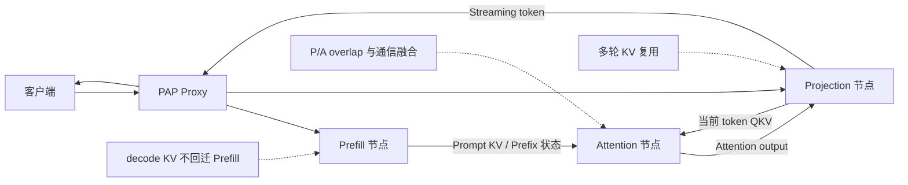
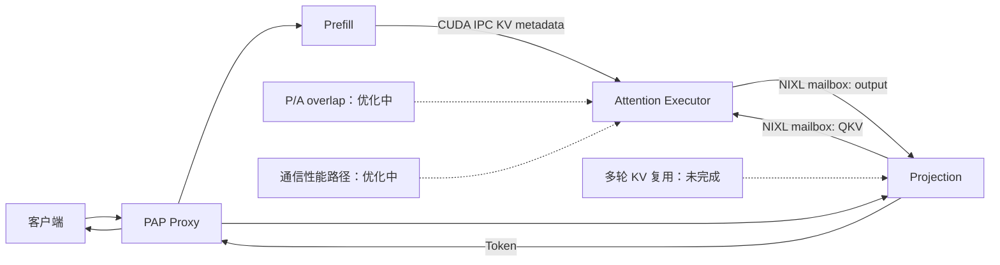

# PAP 项目周报

## 第一部分：进展总结

本周围绕 PAP Stage-1 完成了一轮集中开发，目标是先把单轮 Prefill-Attention-Projection 分离链路跑通，并补齐后续性能优化所需的通信、路由、启动、测试和实验基线。当前代码已经具备单轮端到端运行能力，可以在多种拓扑下启动和采集数据。

### 本周主要完成内容

| 方向          | 进展                                                         |
| ------------- | ------------------------------------------------------------ |
| 单轮链路      | 已跑通 `Prefill -> Attention -> Projection` 执行路径。Prefill 处理 prompt 并持有 prompt KV，Attention 读取 Prefill KV 并执行远端 attention，Projection 负责 decode 主流程和 token 输出。 |
| KV 与执行通信 | OFFLOAD_KV 默认走 **CUDA IPC**；OFFLOAD_EXEC 已支持 **NIXL mailbox**，Projection 和 Attention 可通过 mailbox 交换 QKV 与 attention output。 |
| 多拓扑启动    | 已支持 1PA1P、3PA1P、4PA4P、6PA2P、TP=2 等实验形态。         |
| 模型接入      | Qwen3 dense 和 Qwen3-MoE 已接入 PAP 路径；已有 Qwen3-8B、30B、32B 相关实验。 |
| 性能探索      | runner-level microbatch、layer wavefront、Q-first/KV-later 等方向已有原型或 opt-in 实验；部分小规模场景有收益，30B/32B 场景仍需要进一步优化。 |
| 可观测与测试  | 已补充 `tests/pap` 覆盖，并增加 trace summary 工具，用于定位 Projection/Attention 往返、mailbox 读写和 Attention 计算耗时。 |

### 当前阶段结论

- PAP Stage-1 已完成单轮基础链路验证，具备继续做性能优化的基础。
- **现有实现的主要瓶颈集中在每层 Projection/Attention 往返和 mailbox 热路径，单次 NIXL READ 耗时占比较小**。
- 在固定 30B 工作负载上，当前 PAP 仍落后于已有 PD-NIXL 基线；后续重点应放在 fused remote Attention、P/A overlap、通信热路径和多轮 KV 复用。
- Qwen3-32B 大 batch 复测进一步确认：即使把 512 个 decode 请求组织成 `170/170/172` 三个 ubatch，Projection 侧看到的 remote Attention path 仍主要消耗在等待和回收结果，而不是本地 projection kernel 本身。

### PD/PAP 负载实验对比样例

下面只列少量代表性历史结果，目的不是完整参数搜索，而是说明当前状态：**PAP 已经能端到端跑通，但在现有实现下仍明显慢于 PD**。

| 模型 / 负载 | PD 配置与结果 | PAP 配置与结果 | 结论 |
| --- | --- | --- | --- |
| Qwen3-8B, input512/output32, qps2, 8 prompts | PD `6P2D`: `51.95` output tok/s, `23.53 ms` TPOT | PAP `6PA2P`: `47.84` output tok/s, `35.58 ms` TPOT | PAP 可稳定完成；吞吐接近 PD，但 TPOT 约 `1.5x`。 |
| Qwen3-32B, input1024/output64, qps4, 128 prompts, TP=2 | PD `2P2D`: `222.97` output tok/s, median TPOT `55.81 ms` | PAP `2PA2P`: `90.70` output tok/s, median TPOT `566.13 ms` | PAP 完成 `128/128`，但吞吐约低 `2.46x`，TPOT 约高 `10.1x`。 |
| Qwen3-32B, input128/output64, burst 512 prompts, TP=2 | PD `3P1D`: `1004.51` output tok/s, mean TPOT `210.53 ms` | PAP `3PA1P` NIXL mailbox: `208.32` output tok/s, mean TPOT `2224.55 ms` | PAP 完成 `512/512`，但吞吐约低 `4.8x`，TPOT 约高 `10.6x`。 |

这些结果支撑两个判断：

- **功能层面**：PAP Stage-1 已经不是只能跑小 sanity case；8B、32B、TP=2、大 batch burst 都有成功记录。
- **性能层面**：当前 PAP 的瓶颈还在每层 Projection/Attention 边界和调度/通信路径，扩大 batch 或换到 32B dense 模型并不会自动追平 PD。

结果来源：

- `../test/baseline/pap/docs/pap_topology_pilot_20260523.md`
- `../test/baseline/pap/docs/pap_pd_32b_tp2_comparison_20260527.md`
- `benchmarks/disagg_benchmarks/results/qwen3_32b_pd_vs_pap_ctx128_bs512_20260528/README.md`

完整大 batch trace 结果：

| 指标                       |      Median | P90 / 说明      |
| -------------------------- | ----------: | --------------- |
| Projection send            |  `1.267 ms` | p90 `1.785 ms`  |
| **Projection yield**       | `50.317 ms` | p90 `56.308 ms` |
| Projection recv            | `11.818 ms` | p90 `24.143 ms` |
| Projection remote_total    | `62.808 ms` | p90 `77.494 ms` |
| Projection self_attn_total | `77.708 ms` | p90 `80.633 ms` |
| Attention recv_qkv         |  `3.328 ms` | p90 `3.839 ms`  |
| **Attention compute**      | `20.291 ms` | p90 `25.483 ms` |
| Attention send_output      |  `0.038 ms` | p90 `0.050 ms`  |
| Attention total            | `23.874 ms` | p90 `29.179 ms` |

异步 CUDA event profile 进一步拆解了 Projection 本地计算。过滤 projection workers 且 `batch_size in [170, 172]`：

| Projection stage                 |     Median |         P90 |
| -------------------------------- | ---------: | ----------: |
| `qkv_proj`                       | `0.109 ms` |  `0.110 ms` |
| `qk_norm_rope`                   | `0.014 ms` |  `0.014 ms` |
| `o_proj`                         | `0.378 ms` | `15.570 ms` |
| `mlp`                            | `0.913 ms` |  `0.922 ms` |
| `qkv + qk_norm_rope + o_proj`    | `0.501 ms` |           - |
| sampled non-attention layer work | `1.429 ms` |           - |

结论：

- 大 ubatch 下，远端 Attention kernel 本身 median 约 `20 ms`，但 Projection 侧 remote path median 约 `63 ms`，self-attn section median 约 `78 ms`。
- 本地 projection/MLP GPU kernel median 只有约 `1.4 ms`，不足以覆盖 `yield + recv` 的长等待；因此当前瓶颈不是“projection 计算太长，可以自然 overlap”，而是 Projection/Attention 往返路径和结果回收排队太长。

## 第二部分：项目整体介绍

### 项目目标

PAP 将一次大模型推理拆成三个角色：

- **Prefill**：处理 prompt 阶段，维护 prompt KV。
- **Attention**：独立执行 attention 计算，读取 Prefill KV，并接收 Projection 当前 token 的 QKV。
- **Projection**：执行 decode 主流程、projection 和 token 输出。

拆分后的**长期目标是提高资源分工效率，降低多轮对话中的 KV 搬运成本**。尤其在多轮场景中，理想状态是不再把 decode KV 反复回迁到 Prefill 节点，从而减少跨节点数据流动和重复准备。

### 目标架构

### 当前架构

当前版本是可运行的 Stage-1：**Projection 通过 NIXL mailbox 请求 Attention 计算，Attention 通过 CUDA IPC 读取 Prefill prompt KV，并将 attention output 返回给 Projection。系统已经具备运行、测试和 trace 能力。**

### 已完成、进行中和后续计划

| 分类     | 内容                                                         |
| -------- | ------------------------------------------------------------ |
| 已完成   | 单轮 PAP 分离链路；OFFLOAD_KV CUDA IPC；OFFLOAD_EXEC NIXL mailbox；多拓扑启动；Qwen3 dense/MoE 接入；trace summary；`tests/pap` 关键测试覆盖。 |
| 正在进行 | 降低 Projection/Attention 每层往返成本；改进 microbatch 策略；优化 mailbox 热路径；扩大 8B/30B/32B 负载验证；梳理 PAP 与 PD 的适用边界。 |
| 后续计划 | 实现 fused batch remote Attention；引入更固定的 slot/ring 通信协议；完善 P/A overlap；推进多轮 KV 复用和 decode KV 不回迁；沉淀推荐拓扑和参数组合。 |
| 预期效果 | 短期降低 TPOT 并缩小与 PD-NIXL 的差距；中期在高并发、MoE、高 KV 压力场景中体现资源拆分收益；长期在多轮对话中减少 KV 搬运和重复准备。 |

### 当前边界

- Stage-1 聚焦单轮请求，暂不包含 request-finalization KV sync、bidirectional KV pull-back、prefix attach 和 multi-turn cache reuse。
- Q-first/KV-later、Q-first Projection、Attention partial overlap 等路径已有 opt-in 实验，但默认关闭；已有记录显示这些路径在当前实现下可能回退 TPOT。
- 当前 mailbox 路径功能可用，性能路径仍需继续优化。下一阶段不应只依赖调大 scheduler concurrency，而应优先降低 batched remote Attention 和 P/A 边界成本。

## 第三部分：模块进度时间轴

| 日期           | 模块                                      | 进展                                                         |
| -------------- | ----------------------------------------- | ------------------------------------------------------------ |
| 05-20 ～ 05-22 | `examples/pap`                            | 搭建 Stage-1 启动入口和多实例实验形态。                      |
| 05-20 ～ 05-22 | `vllm/pap`                                | 建立 PAP 基础模块，验证 NIXL 原型和 true-split Attention 方向。 |
| 05-23          | `examples/pap`                            | 参数化 benchmark 拓扑，更新 launcher 拓扑测试。              |
| 05-23          | `vllm/pap/remote_attention.py`            | 压缩 OFFLOAD_EXEC 控制消息，优化 attention TCP socket 行为。 |
| 05-24          | `vllm/pap/data_plane.py`                  | 默认启用 OFFLOAD_KV CUDA IPC，增加 KV IPC 描述符、序列化和导入逻辑。 |
| 05-24          | `vllm/pap/shadow_attention.py`            | 支持 Attention 侧读取 Prefill KV，增加 KV import guard 和日志。 |
| 05-24          | PAP KV 管理方向                           | 探索 resident KV、conversation placement、decode slot 等方向；当前 Stage-1 收敛为单轮链路。 |
| 05-25          | `vllm/pap`、`examples/pap`                | 清理 Stage-1 分支，明确当前版本聚焦单轮 PAP 分离。           |
| 05-26          | `vllm/pap/nixl_mailbox.py`                | 形成 NIXL mailbox checkpoint，增加 slot、ACK、zero-copy receive、trace 等能力。 |
| 05-26          | `vllm/v1/worker/gpu/model_runner.py`      | 增加 PAP runner-level 3-way microbatch pipeline 和 decode threshold。 |
| 05-26          | `tools/pap_trace_summary.py`              | 增加 trace 汇总能力，定位 Projection/Attention 边界耗时。    |
| 05-26          | `docs/design`                             | 记录 4PA4P、6PA2P、3-way microbatch 等实验。                 |
| 05-27          | `examples/pap/launch_pap_nixl.sh`         | 增加 tensor-parallel 启动支持，支撑 30B/32B 实验。           |
| 05-27          | `vllm/model_executor/models/qwen3.py`     | 接入 PAP decode trace 和 microbatch hook，支持 Qwen3 dense 路径分析。 |
| 05-27          | `vllm/model_executor/models/qwen3_moe.py` | 接入 Qwen3-MoE PAP 路径，增加 wavefront / ubatch 原型和保护逻辑。 |
| 05-27          | `tests/pap`                               | 补充 proxy、payload、contract、trace、routing 等测试覆盖。   |
| 05-27          | `docs/design`                             | 记录 30B PD/PAP 对比、concurrency sweep、target-scale wavefront 验证，并明确 fused remote Attention 为下一步重点。 |
| 05-28          | `examples/pap/launch_pap_nixl.sh`         | 稳定 TP=2 启动和端口映射，修复多 PA offload 场景问题。       |
| 05-28          | `vllm/pap`、`qwen3.py`                    | 收敛 Qwen3-32B TP=2 多 PA offload 运行问题，形成后续优化 baseline。 |
| 05-28          | `benchmarks`                              | 增加 Qwen3-32B PD/PAP 相关结果记录。                         |
| 05-28          | `qwen3.py`、`trace_summary.py`            | 补充 Projection timeline、layer timeline 和异步 CUDA event profile，跑通 Qwen3-32B ctx32/bs512/out64 大 ubatch trace，确认 `170/170/172` ubatch 形态。 |
| 05-28          | `examples/pap/launch_pap_nixl.sh`         | 增加 `PAP_MAX_NUM_BATCHED_TOKENS` 传参，修正默认 `2048` batch-token 限制导致 projection calls 只有约 `6` 的实验偏差。 |

## 总结

本周的核心结果是 PAP Stage-1 单轮闭环已经跑通，并且具备了继续优化所需的通信、启动、模型接入、测试和实验基础。05-28 的 Qwen3-32B 大 batch 复测表明，当前 3-way microbatch 已能形成 `170/170/172` 的大 ubatch，但 Projection 侧 remote Attention path 仍主要受 `yield + recv` 等待影响；本地 projection/MLP kernel median 约 `1.4 ms`，不足以覆盖约 `63 ms` 的远端路径。当前版本还没有完成多轮 KV 复用、decode KV 不回迁、P/A overlap 和最终通信性能路径；下一阶段应优先处理 fused remote Attention、P/A 边界成本、mailbox recv/排队和 TP all-reduce 长尾，再继续验证 PAP 在高并发、多轮对话和高 KV 压力场景中的收益。
